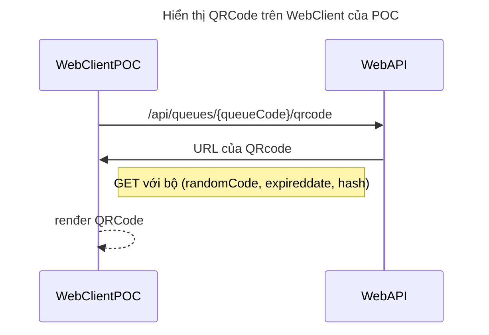
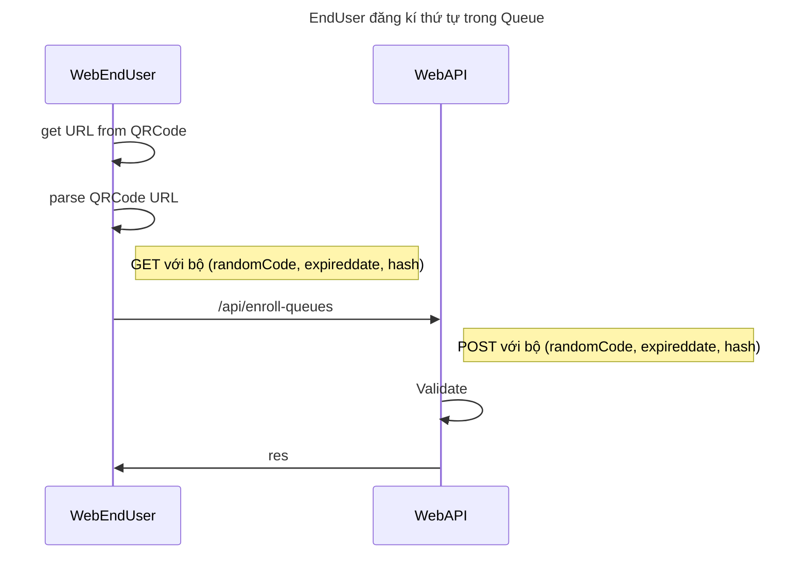
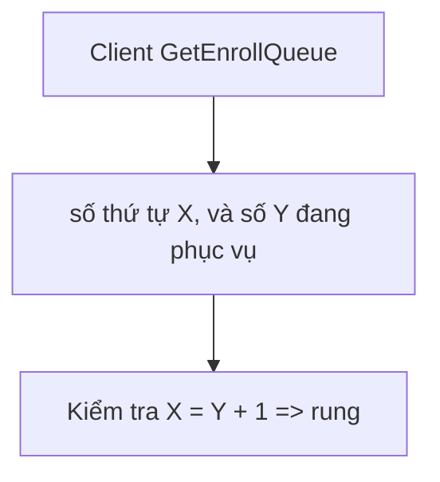
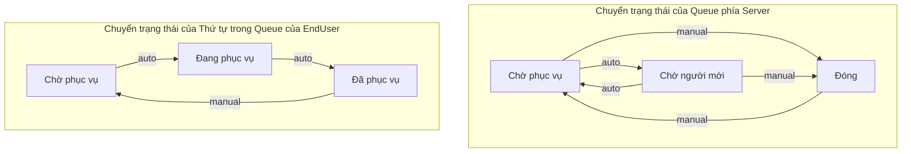

  

<h3 align="center">Waiting Queue project</h3>

---

 
A project make save time when you wainting many services
      

## 📝 Table of Contents

- [About](#about)
- [Getting Started](#getting_started)
- [Deployment](#deployment)
- [Usage](#usage)
- [Built Using](#built_using)
- [Acknowledgments](#acknowledgement)

## 🧐 About 

Includes two project about client and api.
Client is writing by ReactJs.
Api is writing by NestJs

## 🏁 Getting Started 

### Prerequisites

Need:

- NodeJs : >= v16.x, 18.x  
- 
yarn - Using npm to install yarn:  
 <pre>$ npm insatll -g yarn</pre>
- 
Orval - Restful client generator:  
<pre>$ yarn add global orval </pre>
- Mysql

### Installing

 Setup .env from copy .env.example 

<ul>
<li>
<h1> 
  Api
</h1>
<pre>
  $ cd api
  $ yarn install
</pre>

  if you want start dev mode, run: 

  
  <pre>
  $ yarn start:dev
  </pre>

  if you want start prod mode, run: 
  

  <pre>
  $ yarn build 
  $ yarn start:prod
  </pre>

</li>

<li>

<h1> 
  Client
</h1>

<pre>
  $ cd client
  $ yarn install
  $ yarn start
</pre>
</li>
</ul>

## 🚀 Deployment 

You can access live website: https://xephang.online

## ⛏️ Built Using 

- [MySql](https://www.mysql.com/) - Database
- [NestJs](https://nestjs.com/) - Server Framework
- [ReactJs](https://react.dev/) - Web Framework
- [NodeJs](https://nodejs.org/en/) - Server Environment

## ✍️ Authors 

- [@phuthien007](https://github.com/phuthien007) - Idea & Initial work

## 🎉 Acknowledgements 

- Hat tip to anyone whose code was used
- Inspiration
- References
